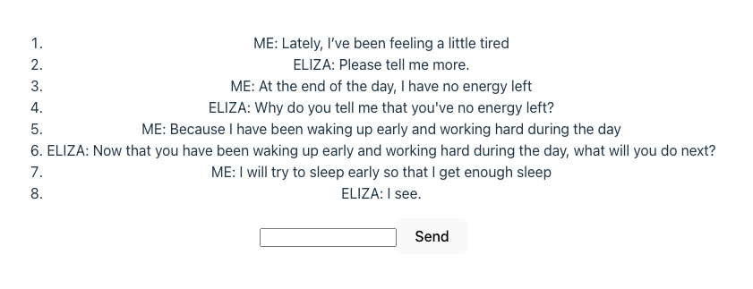

# gRPC Connect Example

Accesses a gRPC endpoint from a browser using the Connect protocol.

- Based on [Connect for Web – Getting Started](https://connectrpc.com/docs/web/getting-started)
- Transport created using createConnectTransport()
- Connect protocol doesn't require a proxy to connect to the service as required for the gRPC-web protocol



## Getting Started

```shell
npm ci
npm run dev
```

Now point your browser to http://localhost:3000

## Code generation from protobuf

```shell
npm run codegen
```